# 🎓 ClassRoom 2.0 – Interactive Classroom Management Platform

<p align="center">
  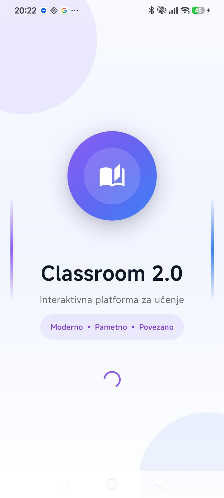
</p>

<p align="center">
Modern Android classroom platform built with Jetpack Compose, Firebase, QR attendance, live quizzes, AI assistance, and real-time student interaction.
</p>

---

# 🚀 About The Project

ClassRoom 2.0 is a modern Android application developed in Kotlin using Jetpack Compose, designed as a digital classroom management system for schools and universities.

The application enables professors to:
- manage subjects digitally,
- create QR attendance sessions,
- launch live quizzes,
- monitor student performance,
- receive anonymous feedback,
- use AI-powered learning assistance.

Students can:
- scan QR attendance,
- participate in live quizzes,
- view grades and statistics,
- communicate anonymously through feedback,
- access assignments and course materials.

---

# 📱 Screenshots

## 🔐 Authentication & Onboarding

<p align="center">
  
  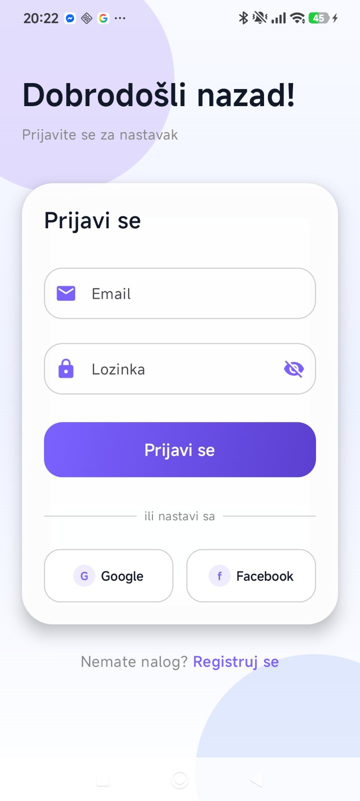
</p>

<p align="center">
  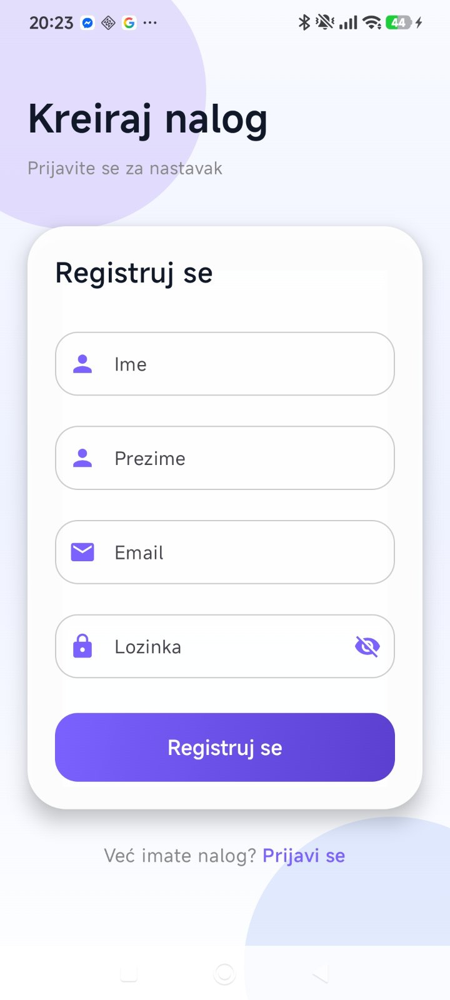
  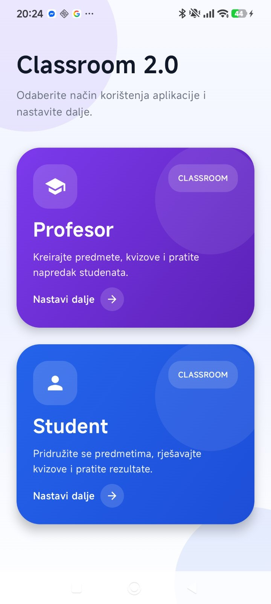
</p>

---

## 👨‍🏫 Dashboard Screens

<p align="center">
  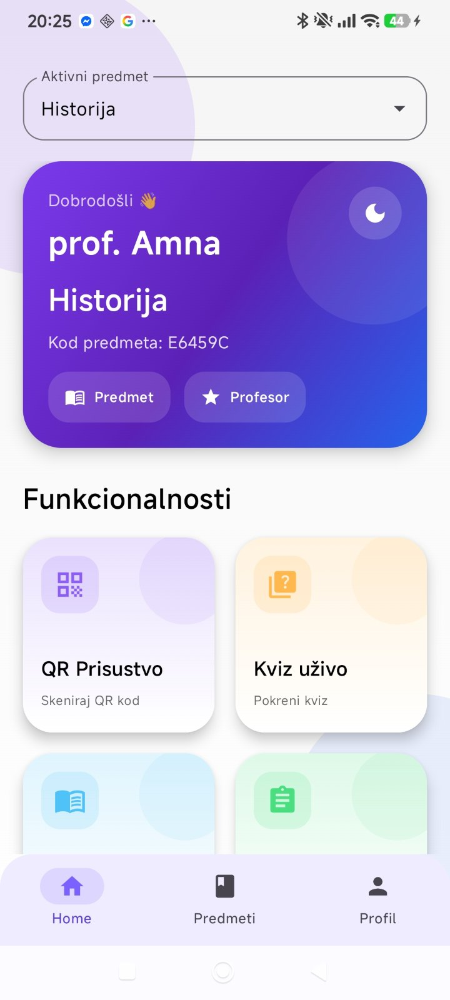
  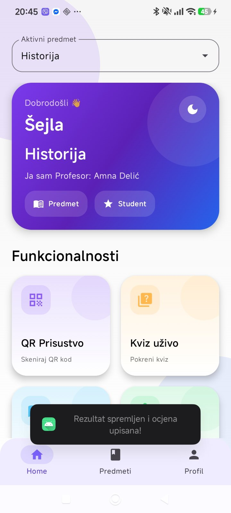
</p>

<p align="center">
  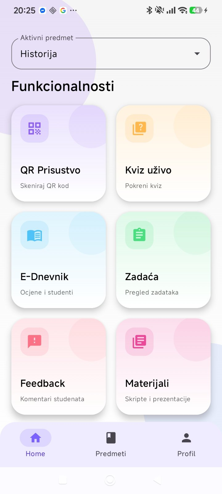
  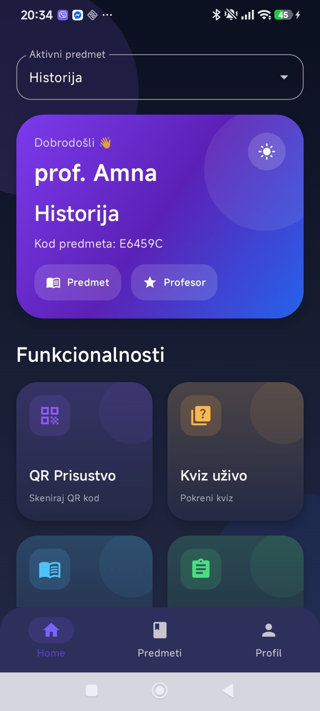
</p>

---

## 📸 QR Attendance & Random Picker

<p align="center">
  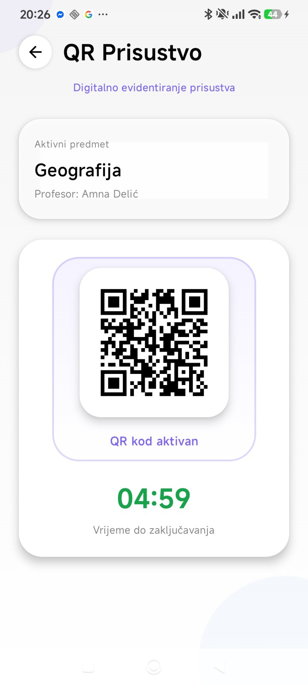
  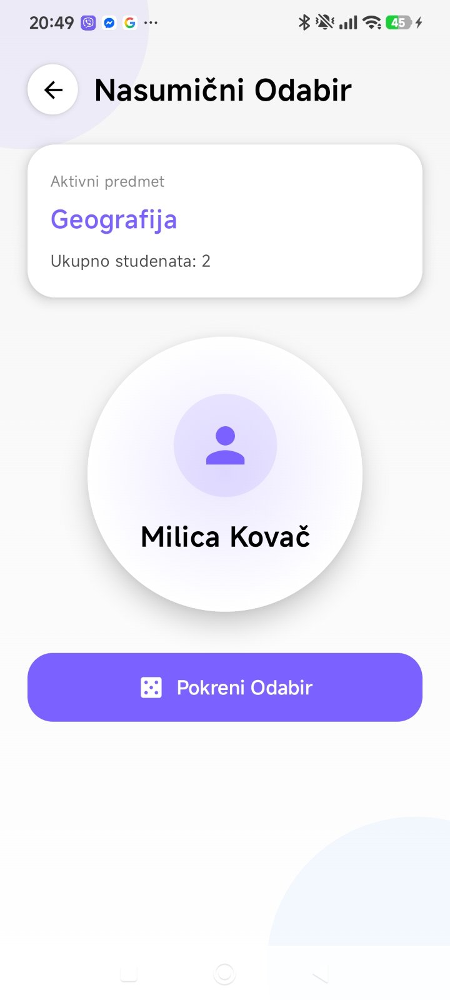
</p>

---

## 🏆 Live Quiz, Rankings & E-Diary

<p align="center">
  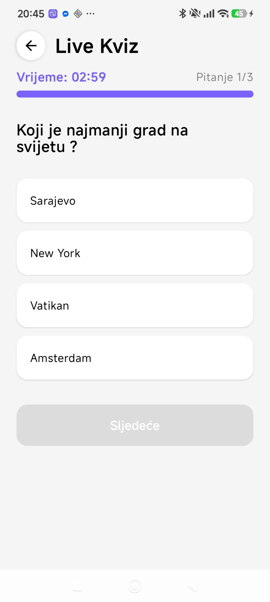
  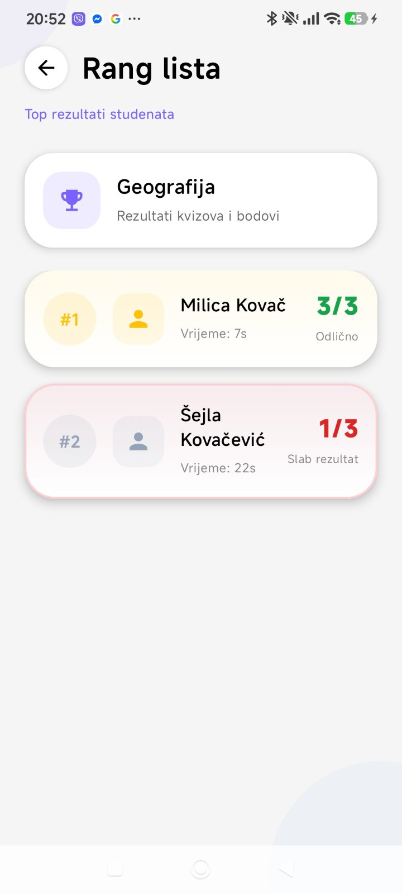
  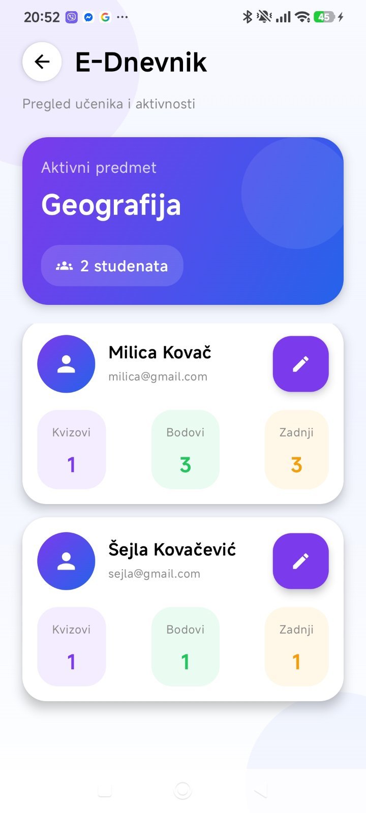
</p>

---

## 💬 Feedback & Profile

<p align="center">
  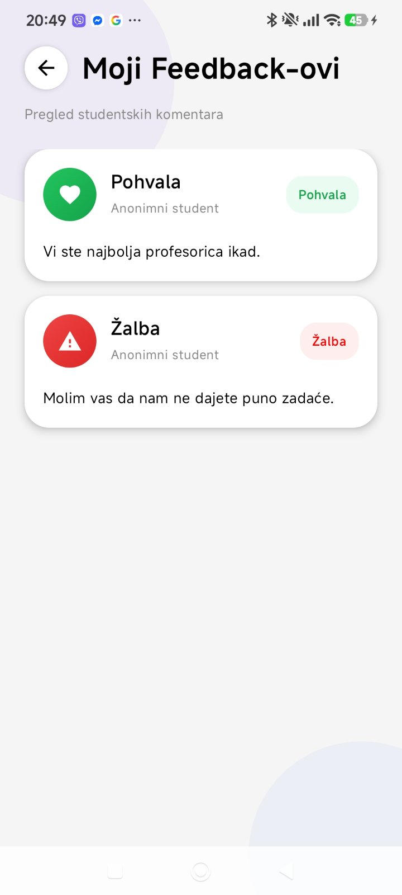
  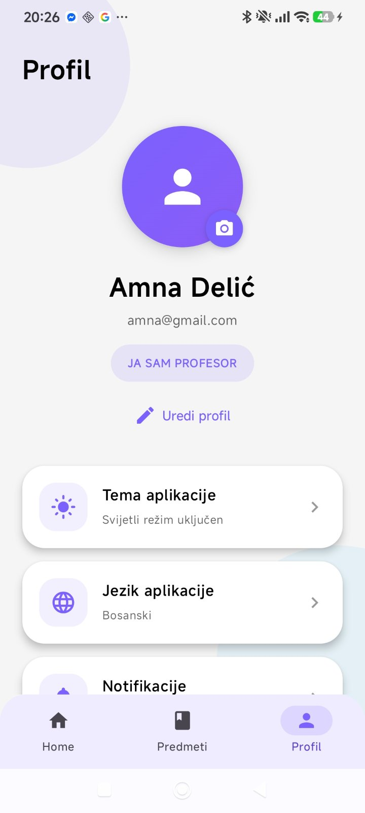
  
</p>

---

## 🤖 AI Assistant

<p align="center">
  
</p>

---

# ✨ Features

## 🔐 Authentication & Smart Session Persistence

- Internal Email/Password registration system
- Separate Professor and Student roles
- Institution access codes:
  - Professor → `PROF2026`
  - Student → `STUD2026`
- Automatic session persistence
- Automatic login after reopening the app

---

## 📚 Subject Management

### Professors can:
- create subjects,
- generate unique subject codes,
- delete subjects,
- manage classroom access.

### Students can:
- join subjects using a generated code,
- enroll in multiple classes,
- access their classroom dashboard.

---

## 📸 Real-Time QR Attendance

- Professors generate QR attendance sessions
- QR code validity: 5 minutes
- Attendance records stored in Firebase Firestore
- Real-time attendance confirmation
- QR scanning implemented with Google ML Kit

---

## 🏆 Live Quizzes & E-Diary

### Quiz System
Professors can:
- create quizzes,
- add questions with 4 answers,
- define correct answers,
- set quiz duration.

Students can:
- solve quizzes live,
- receive points instantly,
- view leaderboard rankings.

### E-Diary
Includes:
- grades,
- quiz statistics,
- professor comments,
- performance history.

---

## 🤖 Groq AI Assistant

The application integrates the Groq API for AI-powered educational assistance.

Students can:
- ask learning-related questions,
- receive explanations,
- improve understanding in real time.

Implementation:
- `GeminiManager.kt`

---

## 🎲 Random Student Picker

Professors can randomly select a student for:
- answering questions,
- classroom participation,
- activities and presentations.

---

## 📬 Assignments, Materials & Anonymous Feedback

### Homework
Professors can:
- create assignments,
- add descriptions,
- manage homework tasks.

### Anonymous Feedback
Students can anonymously send:
- compliments,
- complaints,
- suggestions.

### Materials
A dedicated Materials screen already exists in the UI and is prepared for future Firebase Storage integration.

---

# 🌙 Dark Mode

The application fully supports:
- Light Theme
- Dark Theme

All screens dynamically adapt to the selected appearance mode.

---

# ⚠️ Current Development Status

## 🔐 Authentication
Google and Facebook authentication are currently unfinished and temporarily disabled.

The system currently relies on internal Email/Password authentication.

---

## 📂 File Upload Limitations

Features such as:
- uploading documents,
- profile image saving,
- assignment file submissions

are visually implemented in the UI but currently lack Firebase Storage integration.

---

## 📚 Materials Section
The Materials tab is visually completed and prepared for future backend integration but currently does not fetch real files from the server.

---

# 🛠️ Technologies & Tools

| Technology | Purpose |
|---|---|
| Kotlin | Programming Language |
| Jetpack Compose | Modern Android UI |
| Material 3 | UI Design System |
| Firebase Firestore | Cloud Database |
| Firebase Authentication | User Authentication |
| Google ML Kit | QR Scanning |
| Groq API | AI Assistant |
| Navigation Compose | Navigation |

---

# 🧱 Project Structure

```plaintext
com.example.classroom20
│
├── data
│   ├── FirebaseManager
│   ├── GeminiManager
│   └── Models.kt
│
├── ui
│   ├── components
│   ├── navigation
│   ├── screens
│   │   ├── AIAssistantScreen.kt
│   │   ├── AttendanceConfirmedScreen.kt
│   │   ├── CreateQuizScreen.kt
│   │   ├── DashboardScreen.kt
│   │   ├── FeedbackScreen.kt
│   │   ├── GradesScreen.kt
│   │   ├── HomeworkScreen.kt
│   │   ├── IntroScreen.kt
│   │   ├── LeaderboardScreen.kt
│   │   ├── LiveQuizScreen.kt
│   │   ├── LoginScreen.kt
│   │   ├── MaterialsScreen.kt
│   │   ├── ProfileScreen.kt
│   │   ├── QRAttendanceScreen.kt
│   │   ├── RandomPickerScreen.kt
│   │   ├── RegisterScreen.kt
│   │   ├── RoleSelectionScreen.kt
│   │   └── SubjectsScreen.kt
│   │
│   └── theme
│
├── util
│   └── Localization.kt
│
└── MainActivity.kt
```

---

# ⚙️ Running The Project

## 1️⃣ Clone Repository

```bash
git clone https://github.com/AminaHeljaa/ClassRoom-2.0.git
```

---

## 2️⃣ Open in Android Studio

Requirements:
- Android Studio Ladybug or newer
- Gradle synchronization enabled

Steps:
1. Open Android Studio
2. Select Open Project
3. Choose the project folder
4. Wait for Gradle Sync

---

## 3️⃣ Firebase Configuration

To run the project, create your own Firebase project.

### Required Steps
1. Open Firebase Console
2. Create a new project
3. Add Android application
4. Download `google-services.json`
5. Place the file inside:

```plaintext
app/google-services.json
```

### Enable:
- Firebase Authentication
- Firestore Database

---

## 4️⃣ Run The Application

- Connect a physical Android device
OR
- Start an Android Emulator

Then click:
▶ Run

### Registration Codes
- Professor → `PROF2026`
- Student → `STUD2026`

---

# 🔮 Future Improvements

Planned upgrades:
- Firebase Storage integration
- PDF & presentation uploads
- Google/Facebook authentication
- Push notifications
- Improved AI assistant
- Advanced analytics
- Better architecture separation

---

# 👩‍💻 Author

Developed by:

## Amina Helja

Built using:
- Kotlin
- Jetpack Compose
- Firebase
- Material 3
- Groq AI API

---

